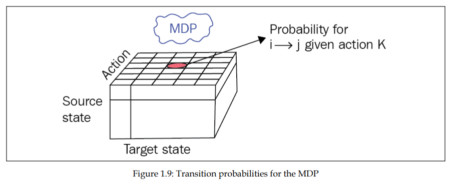

# Reinforcement Learning Training 2025

> Round 1

---

# Where is RL in ML?

---

# Supervised Learning

- We know _all_ the right answers (label)
- We teach machine.

---

# Unsupervised Learning

- We don't know the answer.
- We let machine find structure in the data.

---

# Reinforcement Learning

- We don't know _all_ the right answer
  - but we have a way to conduct _trial-and-error_ experiments.
- We let the machine _discover_ the answers.

---

# Applications

- `ChatGPT`
  - Enhanced by reinforcement learning through a technique called Reinforcement Learning from Human Feedback (RLHF). [[1]](https://youtu.be/WMmGzx-jWvs?si=w6SjqgyBfdlpla6D) [[2]](https://huggingface.co/blog/rlhf)
- `Spot`
  - Utilize reinforcement learning (RL) to enhance their locomotion and manipulation capabilities. [[3]](https://bostondynamics.com/video/reinforcement-learning-with-spot)

---

# Types of RL

- Don't worry. We will come back later.
  

---

# RL Formalism

- Entities
  - Agent
  - Environment
- Communimation
  - Actions
  - Reward
  - Observation

---

# Agent

- An agent is somebody or something that interact with the environment.
- _The thing that is going to solve our problem._

---

# Reward

- A scalar value we obtain periodically from the environment.
  - Can be positive or negative
- Tell our agent how well it has behaved.
- An agent wants to get the largest _accumulated_ reward over its sequence of actions.

---

# Environment

- The environment is everything outside of an agent.
- The agent's communication with the environment is limited to
  - Reward (obtained from the environment)
  - Actions (executed by the agent and given to the environment)
  - Observations (some information besides the reward that the agent receives from the environment).

---

# Action

- Actions are things that an agent can do in the environment.
- Two types of actions
  - **Discrete actions** form the finite set of mutually exclusive things an agent can do, such as move left or right.
  - **Continuous actions** have some value attached to them, such as a car's action turn the wheel having an angle and direction of steering.

---

# Observation

- Observations are pieces of information that the environment provides the agent with that say what's going on around the agent.
- _I am guessing it is something that agent can use to make action?_

---

# Markov Processes (MP)

- Also called a Markov chain
- MP Models a system observed through a sequence of `states`.
  - You cannot influence the system, can only watch.

---

# MP - Markov Property

- The future state depends only on the current state, not on the full history.
  - The current state is enough to predict the future.
- If you think you need history, you can add more quantities to the current state (e.g. adding velocity and acceleration, in addition to position, to model motion)

---

# MP - Example (Weather Model)

- States: `{sunny, rainy}`
- Sequence example: `[sunny, sunny, rainy, sunny, …]`
- The Markov property means the probability of rain tomorrow depends only on today's weather, not previous days.
  - To improve this we can include season with weather states.

---

# MP - Example (Weather Model)

- We can represents the probability of transitioning from state $i$ to state $j$ using the **trantition matrix**.

|       | Sunny | Rainy |
| :---- | :---- | :---- |
| Sunny | 0.8   | 0.2   |
| Rainy | 0.1   | 0.9   |

---

# MP - Example (Weather Model)

- Visual reprentation

---

# MP - Example (Office Worker Model)

---

# MP - Example (Office Worker Model)

- Transition matrix

  | **From \\ To** | **Home** | **Coffee** | **Chat** | **Computer** |
  | :------------: | :------: | :--------: | :------: | :----------: |
  |    **Home**    |   60%    |    40%     |    0%    |      0%      |
  |   **Coffee**   |    0%    |    10%     |   70%    |     20%      |
  |    **Chat**    |    0%    |    20%     |   50%    |     30%      |
  |  **Computer**  |   20%    |    20%     |   10%    |     50%      |

---

# MP - Example (Office Worker Model)

- Visual representation

---

# Estimating the transition matirx

- In real life, we don't know the transition matrix.
- Instead, we estimating transition matrix from **episodes** (sequences of states).
  - Count all observed transitions from each state to every other state.
  - Normalize these counts so that the probabilities from each state sum to 1.
  - With more episodes, our estimation improves.

---

# Markov Reward Processes (MRP)

- We extend MP by associating a reward value with each state transition.
- For each **episode**, the return at time $t$ (denoted as $G_t$) is the sum of future rewards, discounted by $\gamma$ at each step:

$$
G_t
= R_{t+1} + \gamma R_{t+2} + ...
= \sum_{k=0}^{\infty} \gamma^k R_{t+1+k}
$$

- where $\gamma$ is a scalar value between 0 and 1 called a `discount factor`.

---

# MRP - Discount Factor

- $\gamma$ determines how much future rewards are valued compared to immediate rewards.
  - **$\gamma = 1$**
    - The agent values all future rewards equally. This represents perfect foresight.
  - **$\gamma = 0$**
    - The agent only considers the immediate reward, ignoring all future rewards—total short-sightedness.

---

# MRP

- Recall that state transition is probabilistic.
  - $G_t$ can vary even for the same state.
- We want to know the **expected** return instead

$$V(s) = \mathtt{E}[G|S_t = s]$$

- Think about averaging return from many episodes.

---

# Practical example of $V(s)$

- Let $\gamma=0$, calculate $V(s)$

---

# Practical example of $V(s)$

$V(chat) = –1 * 0.5 + 2 * 0.3 + 1 * 0.2 = 0.3$
$V(coffee) = 2 * 0.7 + 1 * 0.1 + 3 * 0.2 = 2.1$
$V(home) = 1 * 0.6 + 1 * 0.4 = 1.0$
$V(computer) = 5 * 0.5 + (–3) * 0.1 + 1 * 0.2 + 2 * 0.2 = 2.8$

- Computer is the most valuable state to be in.

---

# Practical example of $V(s)$

- If $\gamma=1$, then $V(s) = \infty$
- This is why we usually introduce $\gamma < 1$ in MRP.

---

# Markov Decision Process

- Add a set of actions ($A$)
- Agent can now choose an action to take.
- Our transition matrix will now have "action" dimension.

---

---

