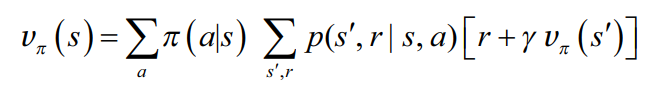
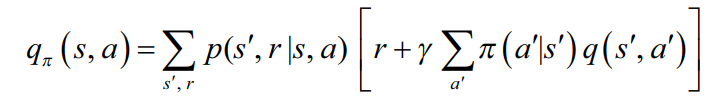

# Reinforcement Learning Training 2025

---

# Bellman's Equation

- Foundation to solving MDP and RL problems.

---

# Recall (1)

- Markov decision process has transition probabilities

$$\mathtt{P}\Big[S_{t+1}=s^\prime, R_{t+1}=r | S_t =s, A_t = a\Big]$$

which transitions the agen to state $S_{t+1}$ and a reward of $R_{t+1}$

- Cumulative reward at time $t$

  $$
  G_t
  = R_{t+1} + \gamma R_{t+2} + ...
  = \sum_{k=0}^{\infty} \gamma^k R_{t+1+k}
  $$

---

# Recall (2)

- A value function is an expected cumulative reward

$$v_{\pi}(s) = \mathtt{E}_{\pi}[G_t|S_t = s]$$

- A action-value value function is an expected cumulative reward from taking action $a$
  $$q_{\pi}(s,a) = E_\pi[G_t | S_t=s, A_t = a]$$

> Note that $v$ and $q$ depend on the policy $\pi$.

---

# Bellman Equation

- Allows relationships among $v$ and $q$.

