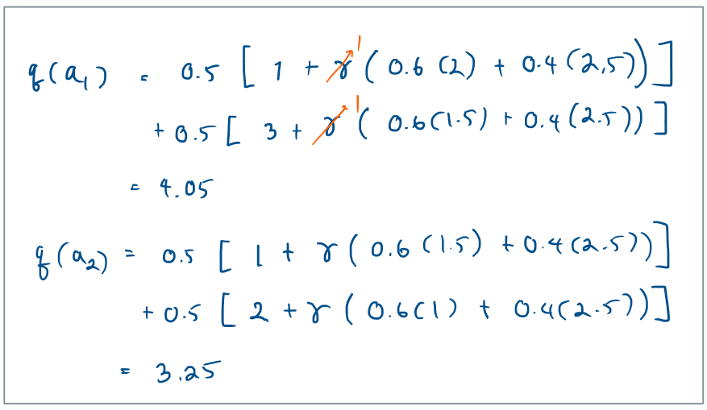

# Reinforcement Learning Training 2025

---

# Bellman's Equation

> Foundation to solving MDP and RL problems.

---

# Recall (1)

- Markov decision process has transition probabilities

$$\mathtt{Pr}\Big[S_{t+1}=s^\prime, R_{t+1}=r \Big| S_t =s, A_t = a\Big]$$

which transitions the agen to state $S_{t+1}$ and a reward of $R_{t+1}$

- Cumulative reward at time $t$

  $$
  G_t
  = R_{t+1} + \gamma R_{t+2} + ...
  = \sum_{k=0}^{\infty} \gamma^k R_{t+1+k}
  $$

---

# Recall (2)

- A value function is an expected cumulative reward

$$v_{\pi}(s) = \mathtt{E}_{\pi}[G_t|S_t = s]$$

- A action-value value function is an expected cumulative reward from taking action $a$
  $$q_{\pi}(s,a) = E_\pi[G_t | S_t=s, A_t = a]$$

> Note that $v$ and $q$ depend on the policy $\pi$.

---

# Bellman Equation

- Allows relationships among $v$ and $q$.

---

# Example

---

# Find $v(s_1)$

---

# Find $v(s_2)$ and $v(s_3)$

---

# Find $v(s_0)$

---

# Result

See values of $v$

---

# Find $q(a_3)$

---

# Find $q(a_4) - q(a_8)$

---

# Result

See $q$

---

# $ Find $q(a_1), q(a_2)$

---

# Result

---

## Can we do better?

---

# Optimal Policy

---

# Optimality Condition

- If agent is following the optimal policy $\pi^*$ (something we want to find), then the value function will also be optimal.

$$v^* (s) = \max_{\pi} v_{\pi}(s)$$

- It follows that

$$v^*(s) = \max_a \Big\{ \sum_{s^\prime, r} p(s^\prime ,r | s, a)[r + \gamma v^*(s^\prime)]\Big\}$$

$$q^*(s,a) =\sum_{s^\prime, r} p(s^\prime ,r | s, a) \cdot \Big[ r    + \gamma \max_{a^\prime} q^*(s^\prime, a^\prime)] \Big]$$

---

# Gridworld Environment

---

# Gridworld

- The top-left and bottom-right positions are terminal states, depicted as shaded cells.

- In each cell, the agent can move UP, RIGHT, DOWN, or LEFT.

- Actions deterministically move the agent in the specified direction, unless blocked by a wall.

- If the agent tries to move into a wall, it remains in its current position.

- The agent receives a reward of -1 for each step taken until it reaches a terminal state.

---

# Policy Evaluation / Prediction

From Bellman's equation.

We use iterative solution.

---

---

# Result

- See a python code that uses a random policy.

---

# Validate Result

---

# Policy Improvement

---

# Policy Improvement

- You can improve the current policy by choose the action with maximum $q$ value and define this to be the new policy.

---

# Policy Improvement

- This is known as the _greedy_ policy.
- Also Note the new state value $v=-1$.

---

# Policy Iteration

---

---

---

---

# Value Iteration

- Merge the policy evaluation and policy improvement together into single operation.

---

# Value Iteration

- The state values will keep improving.
  

- Once the values converges, we can find the optimum policy.
  

---

---

# Generalized Policy Iteration

- Main idea
  

---

# Generalized Policy Iteration

- Full convergence + change policy for all states.

  

---

# Generalized Policy Iteration

- **Partial** convergence + change policy for all states.

---

# Generalized Policy Iteration

- Full convergence + change policy for **partial** states.

