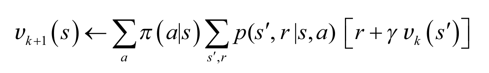
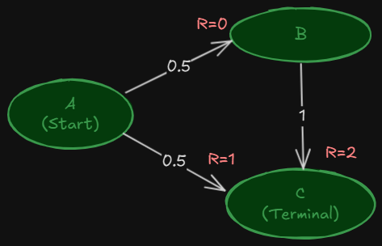

# Reinforcement Learning Training 2025

---

# Model-Free Approach

---

# Motivation

Recall in policy iteration

- To make this work, we need to know the model dynamics or $p(s^\prime, r | s, a)$.
- However, we do now know $p$.
- Instead, we will resort to _sampling_.
  - Collecting experience by following some policy in the real world or running the agent through a policy in simulation.

---

# Model-Free Learning

- Monte Carlo (MC) methods
- Temporal difference (TD) methods

---

# Monte Carlo

- We use the law of large numbers (LLN) from statistics.
  > - Average of samples is a good estimate for the actual unknown quantity.
  > - This estimate becomes better and better as the number of trials of the experiment (samples) increases.

---

# Monte Carlo

- Re call that We want to calculate
  $$v_{\pi}(s) = \mathtt{E}_{\pi}[G_t|S_t = s]$$
- We let the agent start from this state $S_t = s$, follow the policy $\pi$ to take actions, and keep doing so until termination.
  - We call one round of actions an **episode**.
- We record the total sum of rewards for each episode.
- We average the rewards to get an estimate of $v_{\pi}(s)$ for the policy $\pi$.

> MC methods replaces expected returns with the average of sample returns.

---

# Worked Example

---

# Sampling

- We simulate 4 episodes.

| Episode | Path      | Reward Sequence   |
| :------ | :-------- | :---------------- |
| 1       | A → C     | $G_1$ = 1         |
| 2       | A → B → C | $G_2$ = 0 + 2 = 2 |
| 3       | A → B → C | $G_3$ = 0 + 2 = 2 |
| 4       | A → C     | $G_4$ = 1         |

---

# Results

Monte Carlo estimates the value function $v(A)$ as the average return observed after visiting A.

$$
v(A) = \frac{G_1 + G_2 + G_3 + G_4}{4} = \frac{1 + 2 + 2 + 1}{4} = \frac{6}{4} = 1.5
$$
