

# Reinforcement Learning Training 2025

---

# Model-Free Approach

---

# Motivation

Recall in policy iteration

- To make this work, we need to know the model dynamics or $p(s^\prime, r | s, a)$.
- However, we do now know $p$.
- Instead, we will resort to _sampling_.
  - Collecting experience by following some policy in the real world or running the agent through a policy in simulation.

---

# Model-Free Learning

- Monte Carlo (MC) methods
- Temporal difference (TD) methods

---

# Monte Carlo

- We use the law of large numbers (LLN) from statistics.
  > - Average of samples is a good estimate for the actual unknown quantity.
  > - This estimate becomes better and better as the number of trials of the experiment (samples) increases.

---

# Monte Carlo

- Recall that We want to calculate
  $$v_{\pi}(s) = \mathtt{E}_{\pi}[G_t|S_t = s]$$
- We let the agent start from this state $S_t = s$, follow the policy $\pi$ to take actions, and keep doing so until termination.
  - We call one round of actions an **episode**.
- We record the total sum of rewards for each episode.
- We average the rewards to get an estimate of $v_{\pi}(s)$ for the policy $\pi$.

> MC methods replaces expected returns with the average of sample returns.

---

# Worked Example

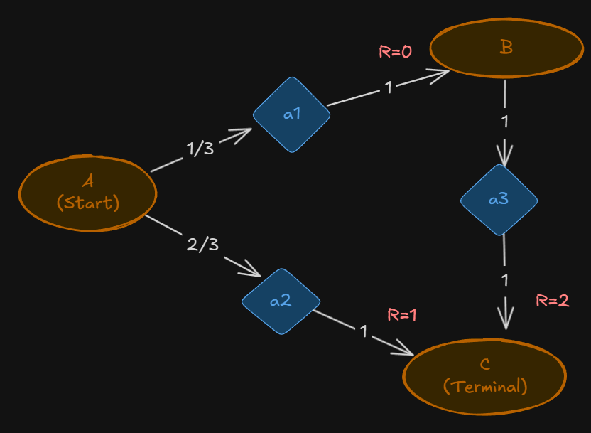

---

# Solution $v$

---

# Solution $q$

---

---

# Estimate $v(A)$

- We simulate many episodes.

| Episode | Path      | Reward from $A$     |
| :------ | :-------- | :------------------ |
| 1       | A → C     | $G_{1}$ = 1         |
| 2       | A → B → C | $G_{2}$ = 0 + 2 = 2 |
| 3       | A → B → C | $G_{3}$ = 0 + 2 = 2 |
| 4       | A → C     | $G_{4}$ = 1         |
| ...     | ...       | $G_{n}$             |

---

# Results

Monte Carlo estimates the value function $v(A)$ as the average return observed after visiting A.

$$
v(A) = \frac{G_{1} + G_{2} + G_{3} + G_{4} + ...}{n} = \frac{1 + 2 + 2 + 1 + ...}{n} \rightarrow \frac{4}{3}
$$

---

# Online Method

- Instead of averaging all the returns at the end (the sample mean), we can use the incremental (update) method to estimate $v(A)$ as each new return is observed.
- This is also called the "sample-average" update and is given by:

$$v_{n+1} = v_n + \frac{1}{n} (G_n - v_n)$$

- Also, note the constant-$\alpha$ version
  $$v_{n+1} = v_n + \alpha (G_n - v_n)$$
  where $\alpha$ is the learning rate.

---

# Estimate $q(a_1)$ and $q(a_2)$

| Episode | Path      | Actions at $A$ | Reward from Action at $A$ |
| :------ | :-------- | :------------- | :------------------------ |
| 1       | A → C     | $a_2$          | $G_{1} = 1$               |
| 2       | A → B → C | $a_1$          | $G_{2} = 0 + 2$           |
| 3       | A → B → C | $a_1$          | $G_{3} = 0 + 2$           |
| 4       | A → C     | $a_2$          | $G_{4} = 1$               |
| ...     | ...       | ...            | $G_{n}$                   |

---

# Estimate $q(a_1)$ and $q(a_2)$

$$
q(a_1) = \frac{G_{2} + G_{3} + ...}{n} = \frac{2 + 2 + ...}{n} \rightarrow 2
$$

$$
q(a_2) = \frac{G_{1} + G_{4} + ...}{n} = \frac{1 + 1 + ...}{n} \rightarrow 1
$$

---

# Online update

$$q_{n+1} = q_n + \frac{1}{n} (G_n - q_n)$$

- Constant-$\alpha$ version
  $$q_{n+1} = q_n + \alpha (G_n - q_n)$$

---

# Comparing estimations of $v$ and $q$

- Notice that the calculation of $v$ and $q$ is the same.
- This is because both functions are fundamentally estimates of an expected value—just over different types of returns.
  - $v(s)$ - average over all times you start at $s$
  - $q(s,a)$ - average over all times you start at $s$ and pick $a$

---

# Monte Carlo: First-Visit vs. Every-Visit

- _First-Visit MC_

  - Only the first time a state (or state-action pair) is visited in an episode, the return following that visit is used to update the estimate.

- _Every-Visit MC_
  - Every time a state (or state-action pair) is visited in an episode, the return following that visit is used to update the estimate (even if visited multiple times within the same episode).

---

# Gridworld

- Calculating $v$ using MC.

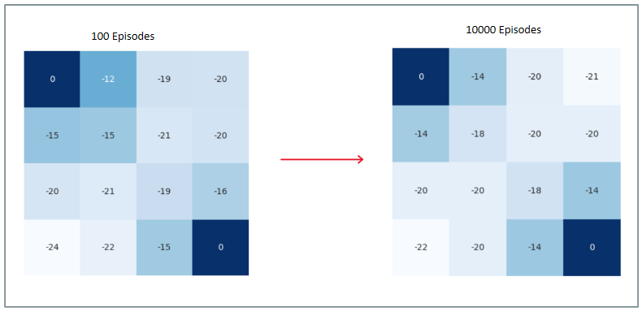

---

# Control with Monte Carlo

- We will use generalized policy iteration (GPI).
  - Find $q$ (not $v$)
  - Improve policy using greedy optimization.
  - Repeat ...

---

# Control with Monte Carlo

- However, in MC, the greedy opimization does not work very well.
  - To be greedy, we need to know all $q$.
  - But being greedy, we will never _explore_ all $q$.
- To fix this, we will use **ε-greedy policy**.

---

# Control with Monte Carlo

- The agent exploits the knowledge with probability 1-ε and explores with probability ε.

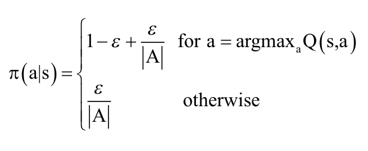

---

# Control with Monte Carlo

- Next, we will not run MC until values of $q$ converges.
- We will run MC prediction followed by policy improvement
  on an episode-by-episode basis.
- This way, there is no need for a large number of iterations in the estimation/prediction step

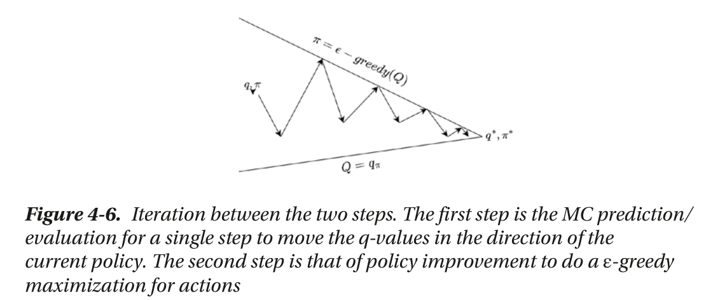

---

# Control with Monte Carlo

- With the two tweaks, we have **Greedy in the Limit of Infinite Exploration (GLIE)**.

---

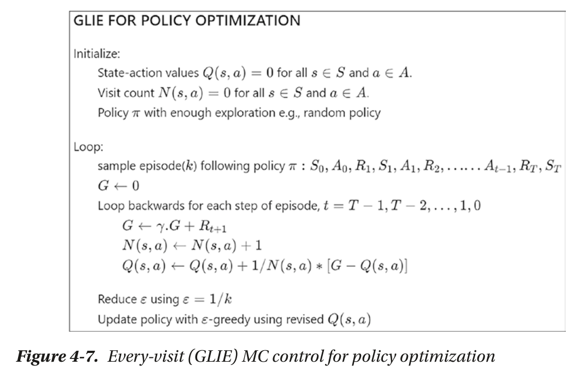

Note that we reduce $\epsilon$ to make policy more deterministic.

---

# Simulation

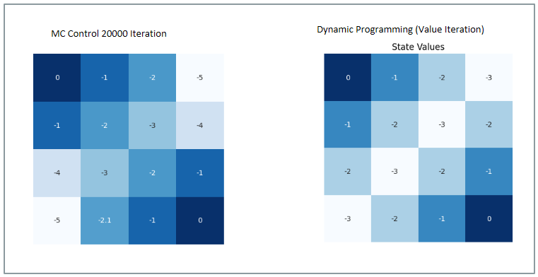

(See python code)

---

# On-Policy vs Off Policy

---

# "On"-Policy MC Control

- In GLIE, we employ $\epsilon$-greedy policy in two process.
  - Finding $v$ or $q$.
  - Maximizing the policy.
- This is called an **on-policy** approach.
- However, the on-policy approach is not efficient.
  - The episode that you collect has to be thrown away.
  - You have no separate ability to control exploration.

---

# "Off"-Policy MC Control

- Another approach is to use two policies.
  - More exploratory to generate samples.
  - Near determistic policy in policy maximization.
- This is called an **off-policy** approach.
  - **Behavior** policy ($b$) for generating samples
  - **Target** policy ($\pi$) in policy maximization

---

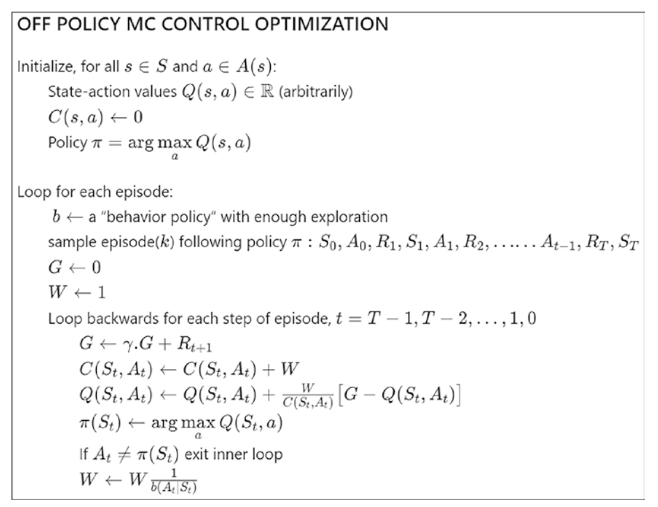

---

# Temporal Difference Learning Methods

---

# Problem with MC

- Only work for episodic environment.
- Only update $q$ when episode ends.
- Temporal difference learning solve these problems.

---

# Update Equation

- Monte Carlo (constant-$\alpha$ version)
  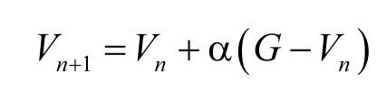

- Temporal Difference, $TD(0)$
  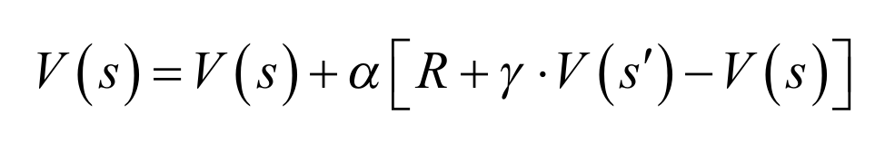

The value of $v$ is estimated with the _estimate_ of the successor state.
This is known as _bootstrapping_.

---

# TD Error

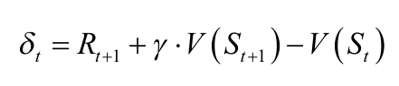

- Error in the estimate of $v$ based on reward and discounted next time-step state value.

---

# Advantages of TD

- Compared with model-based approach, TD does not need knowledge of transition probabilities.
- Compared with Monte-Carlo appraoch, TD can update the value function at every step.
  - Faster convergence.

---

# TD Control

- On-Policy SARSA
- Q-learning
- Expected SARSA

---

# On-Policy SARSA

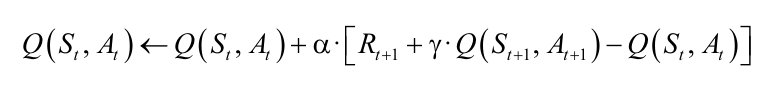

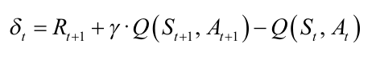

- Note that terminate state -> $q$ equals to zero.

---

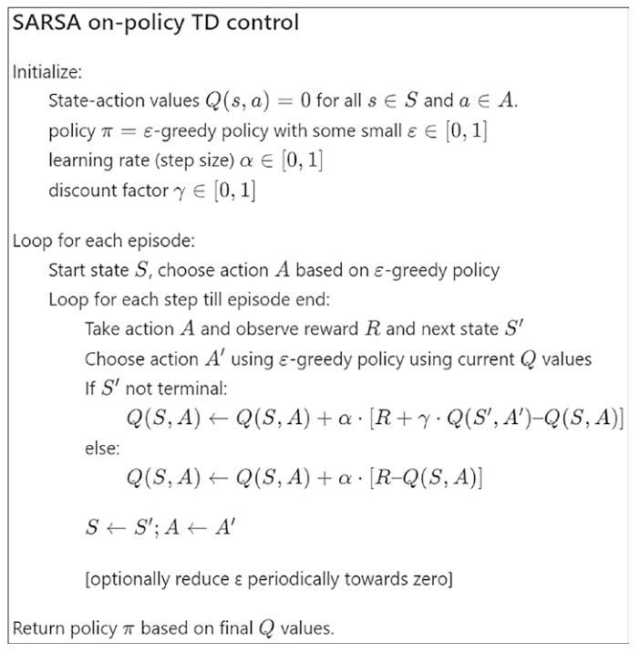

---

# Q-Learning

- SARSA
  

- Q-learning
  

---

# Q-Learning

- You generate samples using $\epsilon$-greedy policy.
- However, when you update $q$, you are using $\operatorname{argmax}_a q$, which is a different policy.
  - This is essentially an off-policy approach.

---

---

# Expected SARSA

- SARSA
  

- Q-learning
  

- Expected SARSA
  

---

