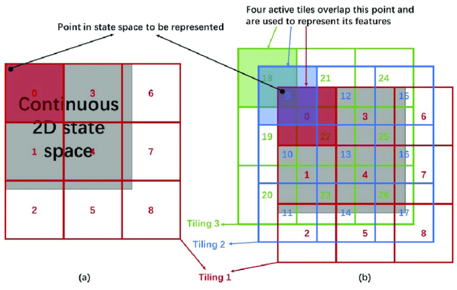

# Reinforcement Learning Training 2025

---

# Functional Approximation

---

# Motivation

- Up till now, we only deal with problems with **discrete** state space.
  - $v$ and $q$ are represented in a table.
  - _Tabular_ case
- Real problem has too many states.
  - The tabular approach requires too much memory and computation.

---

# Formulation

- Instead of representing values in a table, they are now being represented by
  

- where the parameter $w$ is the parameter of the function that defines the policy $\pi(a|s)$ that the agent follows.

---

# What is $w$?

- Tunable parameters of the function that defines the policy.
- Weights of a deep learning neural network.

---

# Changing $w$

- When you update the weight vector $w$ based on some update equation for a specific state $s$ or state action pair $(s, a)$
  - it not only updates the $v$ or $q$ for that specific $s$ or $(s, a)$
  - but it also updates other _nearby_ $v$ and $q$.
- This is different from the tabular case where you can update each $v$ or $q$ independently.

---

# Functional approach

---

# How do we find update equation for $w$?

> We used technique from supervised learning.

- `1` Define a loss function
  
- `2` Update $w$ using gradient descent.
  

---

# Monte Carlo

- Using the update equation (from before)
  
- Gives
  

---

# Temporal Difference (TD(0))

- Using the update equation (from before)
  
- Gives
  

---

# Linear Model

- State value function.
  
- Gradient
  

---

# Linear Model

- Update equation
  

- In MC, $V_{\pi} = g_t$
- In TD(0), $V_{\pi} = R_{t+1} + \gamma \cdot v_t(s^\prime)$

---

# Linear Model

- Update equations
  

---

# Challenge

- Recalled the loss function.
  
- In supervised learning, $y(t)$ are labels that do not change. _(No problem)_

- In RL, $y(t)$ are $v$ or $q$ which keep changing (because we are finding them)
  - _Nonstationarity_ problem
- Also, in TD(0), we use bootstrapping (target is not a true value).
  - This is even worse.

---

---

# Control

- Similar to how you find $v$, here we use $q$
  
- Cost function
  
- Update equation
  

---

# Control

- Gives
  

---

# Control

- We use GPI (same as before).
  

---

# Semi Gradient $n$-Step SARSA

- On policy
  - $\epsilon$-greedy policy for evaluation and control.

---

# Tile Encoding

---

# Tile Encoding

- Binary features

  
  

---

---

---

# Semi-gradient SARSA($\lambda$)

- _Skip for now_

---

# Instability

> 3 ways that can cause instability

---

