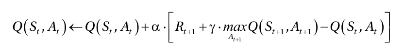
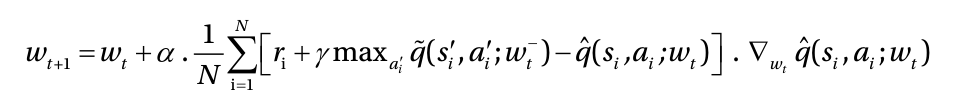
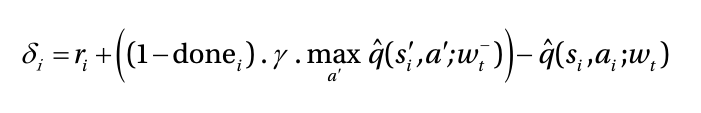
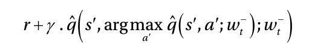
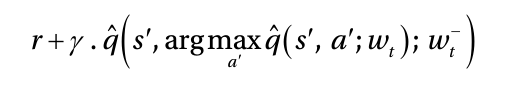
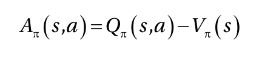
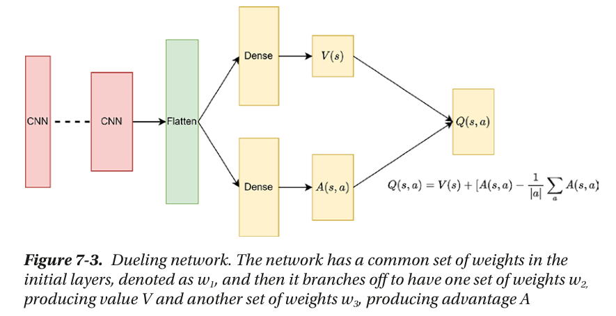

# Reinforcement Learning Training 2025

---

# Deep Q-Learning (DQN)

---

# Update Equations

- Q-learning (tabular)
  
- Deep Q-learning
  

---

# DQN

- No theoretical guarantee of convergence under non-linear function.

---

# Components

- Policies
  - _Behavior policy_: $\epsilon$-greedy policy to explore and generate samples.
  - _Target policy_: deterministic greedy policy (no exploration)
- Networks
  - Target network:
  - Primary network:
- Replay buffer

---

# Improvements to DQN

---

# Prioritized Replay

- Using Prioritized Experience Replay (PER)
  - samples experiences from the replay buffer based on their temporal-difference (TD) error.
  - Focusing on more important or surprising transitions rather than uniform sampling.

---

# Prioritized Replay

- This improves learning efficiency
  - Allowing the agent to learn more effectively from impactful experiences
    - Typically those with large TD errors
  - Leading to better and faster performance in many reinforcement learning tasks.

---

# Double Deep Q-Learning

- Variation of the deep Q-learning algorithm
- Decomposing the `max` operation in the target value into separate action selection and action evaluation processes.
  - Reduce the overestimation of action values calculated in deep Q-learning.

---

# Double Deep Q-Learning

- `DQN`
  

- `DDQN`
  

$w_t^{-}$ is the target network, and $w_{t}$ is the online network.

---

# Dueling Double Deep Q Learning

- Separating the neural network's output into two parallel streams
  - One for estimating the overall state-value
  - Another one for estimating the **advantage** of each action within that state.

---

---

# Dueling Double Deep Q Learning

- Allows the network to learn
  - Which states are valuable independently of the actions available
  - How much better one action is than another
- This leads to more stable and accurate Q-value estimations and improved agent performance.
