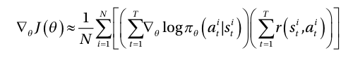
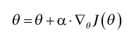
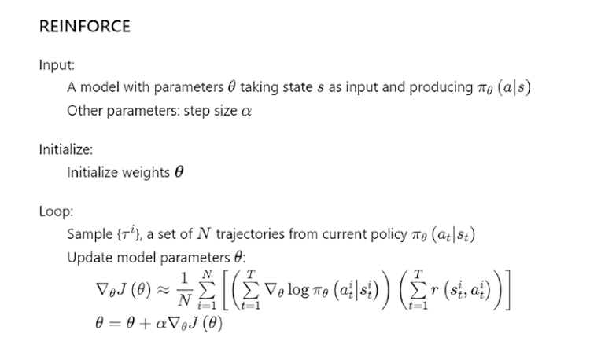
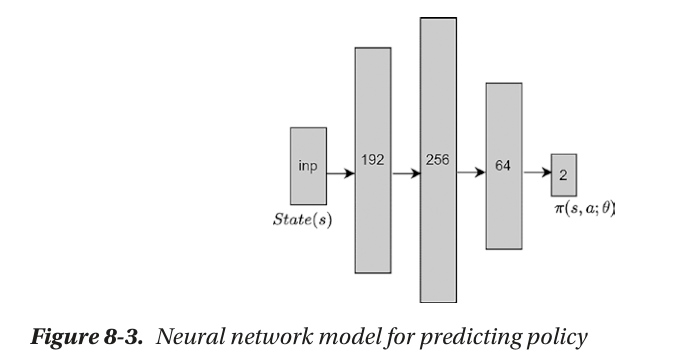
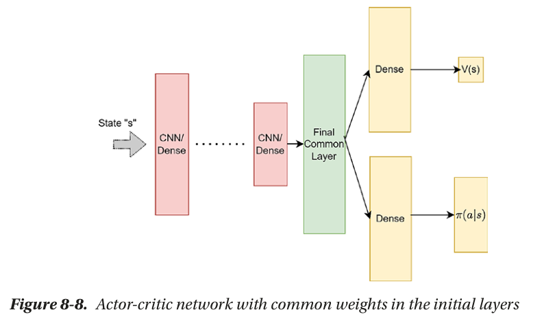

# Reinforcement Learning Training 2025

---

# Policy Gradient Algorithm

---

# Concept

- Policy-based methods parameterize the policy (often with a neural network)
- Focus on optimizing the policy itself (not $q$ or $v$).
- Outputs a probability distribution over actions for each state.

---

# Why?

- Direct policy optimization enables smoother changes

  - Avoiding abrupt behavior shifts seen in value-based methods.

- Can learn stochastic policies natively,

- Handles continuous and large action spaces more naturally

---

# REINFORCE Algorithm

- Learn a policy directly by optimizing the parameters of a policy model using a gradient ascent approach.

---

---

---

# Actor-Critic

Actor-Critic is a class of reinforcement learning algorithms that combines the strengths of both policy-based and value-based methods by maintaining two separate models: an actor and a critic.

---

# Components

- **Actor**
  - The actor is responsible for selecting actions according to a parameterized policy.
  - It learns to maximize the expected reward by adjusting the policy parameters based on feedback from the critic.
- **Critic**
  - The critic estimates the value function ($v$ or $q$).
  - Evaluating how good the actions taken by the actor are in terms of expected cumulative rewards.

---

